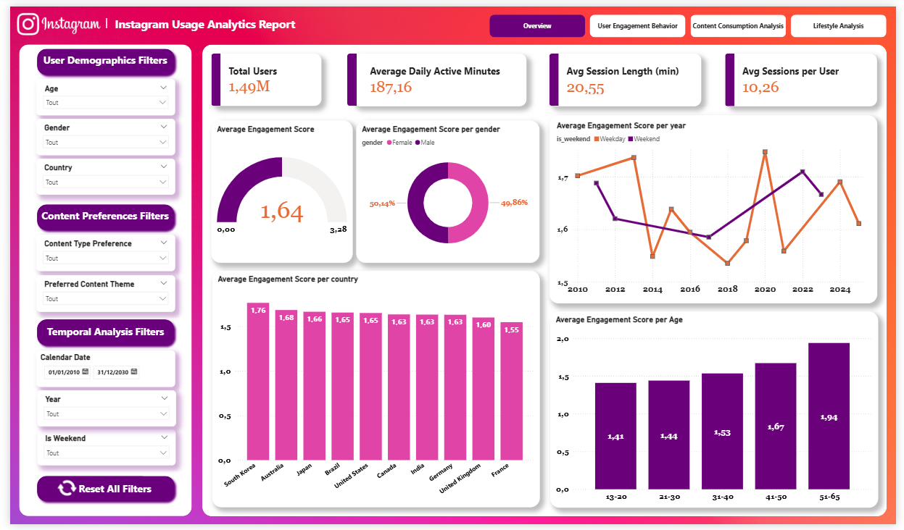
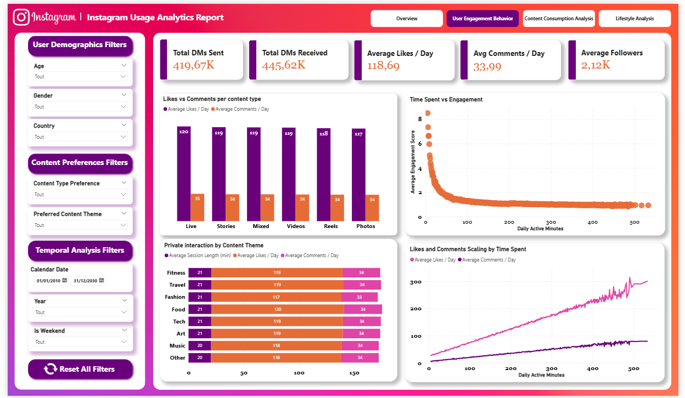
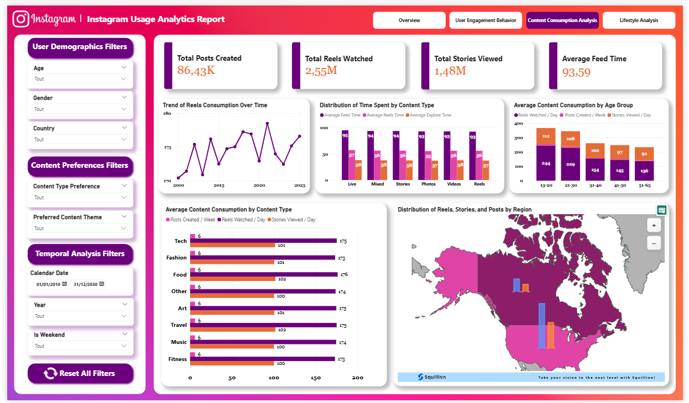
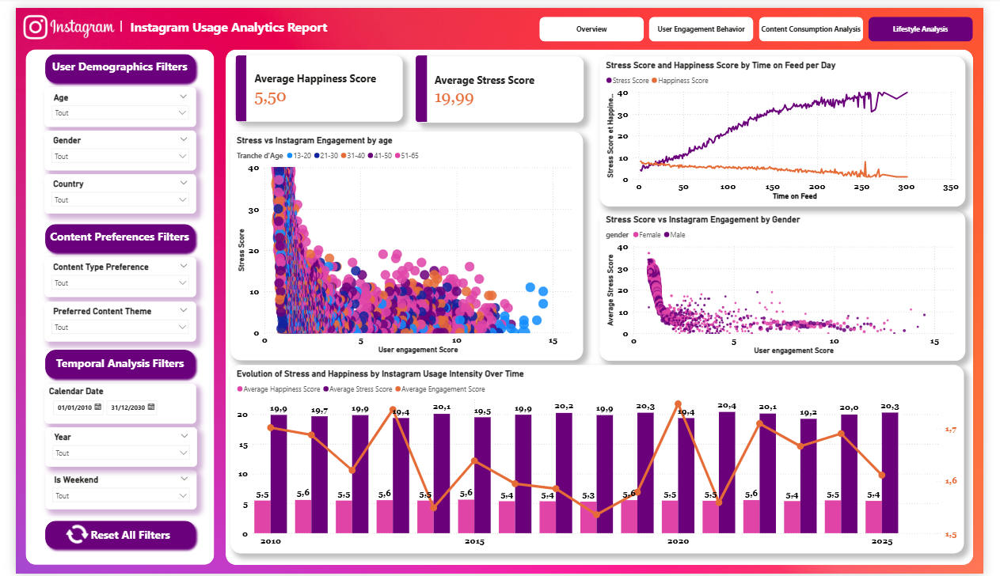

# 📊 Instagram Usage  Analysis – Power BI Project

## 🔎 Project Overview
This project presents an end-to-end **Business Intelligence solution** designed to analyze **Instagram user engagement behavior** and its relationship with **content consumption and lifestyle indicators** such as stress and happiness.

The solution follows a complete BI workflow, from raw data ingestion to interactive Power BI dashboards.

---
## 📁 Dataset

Source: Kaggle

Dataset Name: Social Media User Analysis

Link:
👉 https://www.kaggle.com/datasets/rockyt07/social-media-user-analysis

## 🎯 Project Objectives
- Analyze global Instagram engagement levels
- Understand user behavior and content consumption patterns
- Explore the relationship between Instagram usage, stress, and happiness
- Deliver clear, decision-oriented insights through Power BI

---

## 📁 Dataset Description
- Source: Excel dataset
- Volume: ~1.4 million users
- Structure: 58 columns
- Domains:
  - User demographics
  - Engagement metrics
  - Content preferences
  - Lifestyle indicators

---

## 🏗️ Data Architecture & Pipeline
### 1. Staging Layer
- SQL Server staging database
- Raw data ingestion using Python
- Data cleaning and preparation

### 2. Data Warehouse
- Star schema modeling
- Fact table:
  - `fact_instagram_engagement`
- Dimension tables:
  - `dim_user`
  - `dim_location`
  - `dim_lifestyle`
  - `dim_content_preference`
  - `dim_subscription`
  - `dim_date`

### 3. Analytics & Visualization
- Power BI connected to SQL Server
- DAX measures for KPIs
- Interactive and professional dashboards

---

## 📊 Power BI Report Pages
- **Overview** – Global KPIs and engagement summary 
- **User Engagement Behavior** – Usage patterns and segmentation 
- **Content Consumption Analysis** – Posts, reels, stories performance 
- **Lifestyle Analysis** – Relationship between Instagram usage, stress, and happiness 

---

## 🛠️ Technologies Used
- SQL Server
- Power BI
- Python (ETL)
- Git & GitHub

---

## 🚀 Key Insights
- Engagement varies significantly by country and content type
- High engagement correlates with lifestyle indicators
- Clear trends between Instagram usage intensity, stress, and happiness

---

## 👤 Author
**Yasmine EN-NACHATI**  
Junior Data Analyst / BI Analyst
